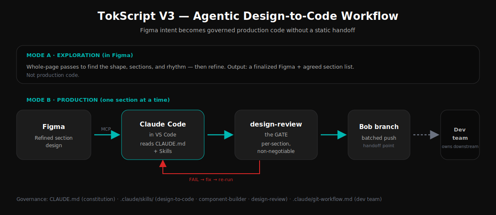

# Agentic Design-to-Code Workflow

A governed, AI-native methodology for translating design intent into production
front-end code — built and used on **TokScript V3**, a live AI-powered social-commerce
product (web dashboard, landing pages, Chrome extension, and an MCP integration that
runs TokScript inside Claude and ChatGPT).

This repository is the **governance layer** of that workflow: the constitution, the
Skills, and the handoff rules that let an AI coding agent (Claude Code) produce
consistent, system-compliant code directly from Figma — without the traditional static
Figma-to-developer handoff.



---

## The problem this solves

The traditional handoff is lossy: a designer exports Figma frames, a developer
re-interprets them, and the result drifts from the design — different spacing, invented
colours, missing states, inconsistent components. Every screen ends up slightly
different. "Looks right" replaces "matches the system."

AI coding agents can close that gap, but only if they are *governed*. An ungoverned
agent given "build this screen" will improvise — that is the same drift, faster. The
innovation here is the governance: a machine-readable design system plus a set of Skills
that make the translation **deterministic**. The same Figma section yields the same
code structure every time, regardless of which session runs it.

---

## How it works

Design intent flows from Figma to production code through a governed pipeline:

1. **Figma → Figma MCP → Claude Code (in VS Code).** The agent reads the design
   directly through the Figma MCP connector — no manual export, no re-interpretation.
2. **The agent reads `CLAUDE.md` and the Skills first.** Before writing any code it
   knows the tokens, the component contract, the responsive rules, and the product
   domain facts.
3. **It builds one section at a time**, runs a mandatory self-review gate, and reports
   exactly which rules it applied.
4. **It pushes to a personal branch ("Bob")** — the handoff point. The dev team owns
   everything downstream.

The agent works in two modes: **exploration** (whole-page passes in Figma, to find the
shape of a page) and **production** (one section at a time, in Claude Code). See
[`CLAUDE.md` §7](CLAUDE.md).

---

## Repository structure

```
.
├── CLAUDE.md                          The constitution — the AI-native design system
├── .claude/
│   ├── git-workflow.md                Dev team's Git rules (this workflow defers to it)
│   └── skills/
│       ├── design-to-code/SKILL.md    Front of the loop: Figma → tokens → skeleton → fill
│       ├── component-builder/SKILL.md  Builds each component to the contract
│       └── design-review/SKILL.md      The GATE: every section must pass before shipping
└── docs/
    ├── assets/workflow.svg            The diagram above
    └── tokscript-v3.md                The commercial application — what this built
```

---

## The governance layer

### `CLAUDE.md` — the constitution
A machine-readable design system: colour and surface tokens (a near-black canvas with a
single teal accent and per-platform colours), an 8px spacing scale, the Inter type
scale, a layered surface/elevation model, responsive breakpoints, the component
contract, and product domain rules. It is the single source of truth an agent reads
before every task. ["Looks right" is not done; "matches the system" is.](CLAUDE.md)

### `.claude/skills/` — the operating layer
Three interlocking Skills with separated concerns:

- **`design-to-code`** decomposes a Figma section, maps every visual to a sanctioned
  token, builds the responsive skeleton, then fills it.
- **`component-builder`** builds each unit (button, card, input, pill, platform chip) to
  the contract: typed props, every interactive state, accessibility, token-driven.
- **`design-review`** is the gate — eight check groups plus a hard-fails list. A section
  that has not passed is not done.

`design-to-code` calls `component-builder` to build the pieces, then hands the section to
`design-review` to pass or block it. A failed gate loops back for a fix and re-run.

### `.claude/git-workflow.md` — the boundary
Git, branch, PR, CI, and promotion rules are owned by the dev team. This workflow
*defers* to that file and stops at the personal branch. Knowing where the design role
ends and the team's begins is part of the system.

---

## Why this is an innovation, not "using an AI tool"

Using an AI tool is giving Claude a prompt. This is an *engineered system*: a governed
constitution, a separation-of-concerns Skill architecture, an enforced quality gate, and
an explicit handoff boundary — applied to a live commercial product. The output is
consistency at scale: production code that matches the design system every time, built
faster than a traditional handoff and without the drift.

See [`docs/tokscript-v3.md`](docs/tokscript-v3.md) for the commercial application.

---

*Maintained by [@bobatetio](https://github.com/bobatetio). Built for TokScript V3.*
